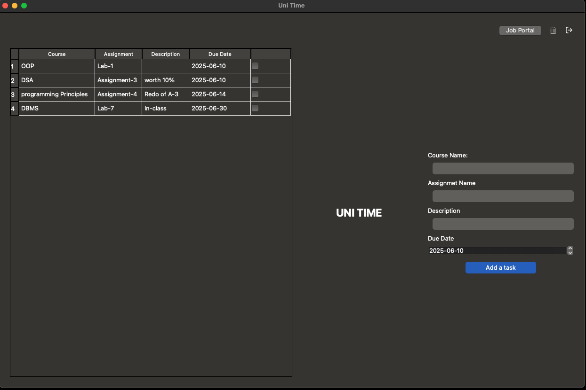
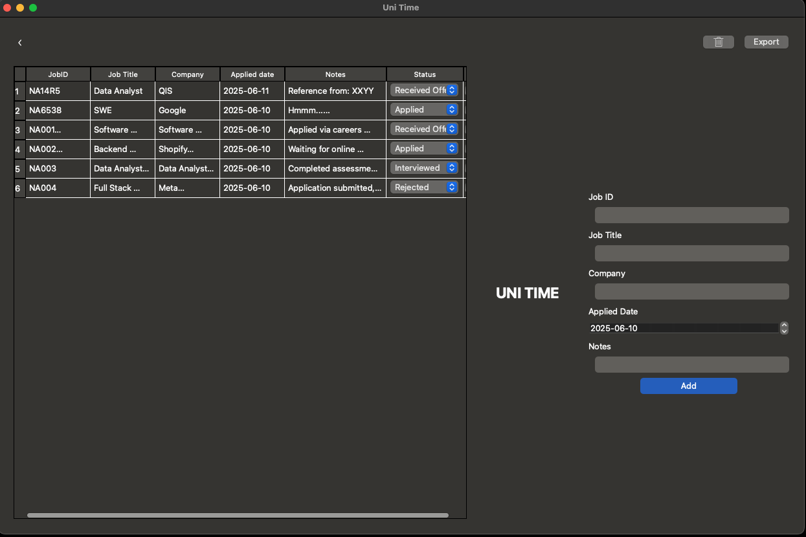

## 🕒 UNI TIME

**Uni Time** is a productivity application designed to help students and job seekers manage their assignments and job applications efficiently.

### 🚀 Features

- Track assignments with due dates
- Monitor job applications with status updates
- Clean and intuitive GUI using PyQt6
- Data stored locally using SQLite

### 🛠️ Tech Stack

- **Programming Language**: Python 3.x  
- **GUI Framework**: PyQt6  
- **Database**: SQLite  

### 📸 Screenshots  

#### TASK PAGE


### JOB PORTAL



### 🔧 Installation

1. Clone this repository:

   ```bash
    https://github.com/NKLoffi/uni_time.git
   ```

2. Create a virtual environment and install dependencies:

   ```bash
   python -m venv venv
   source venv/bin/activate  # On Windows: venv\Scripts\activate
   pip install -r requirements.txt
   ```

### 📂 Project Structure

```plaintext
uni_time/
|
├── Assets/               # Pictures
├── src/
│   ├── ui/               # UI files
|   |   ├──pages/               
│   ├── app.py            # Entry point
│   └── database.py       # DB setup
├── UI_Files               # UI files
├── README.md             # Project documentation
└── requirements.txt      # Requirements

```

### 🤝 Contributing

Pull requests are welcome! For major changes, please open an issue first to discuss what you would like to change.

### 📄 License

This project is licensed under the [MIT License](LICENSE).